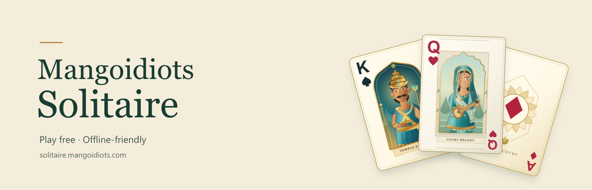
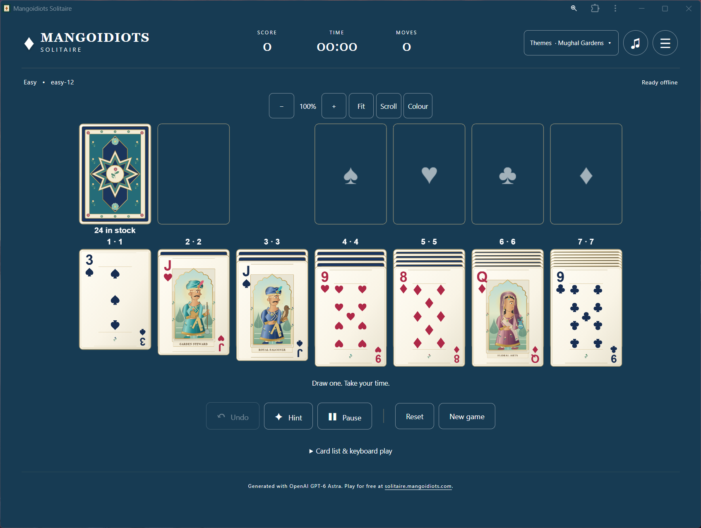
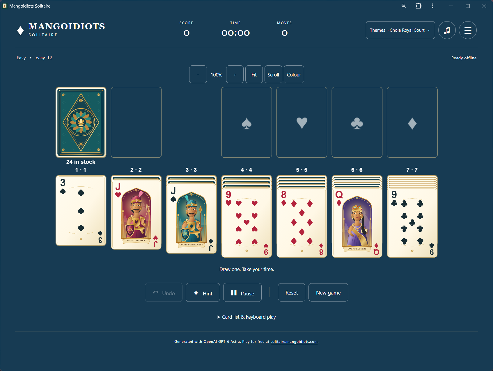

# Mangoidiots Solitaire



An offline-first Draw 1 Klondike game with original Chola and Mughal themes,
responsive card interactions, synthesized music, local saves, and no account or
remote progress tracking.

**Generated with OpenAI GPT-6 Astra.**

Play at <https://solitaire.mangoidiots.com/>.

## What's new in 1.3.3

The footer now shows the exact application version, sourced from the same
package metadata used by the build and offline worker. In short mobile
landscape, the permanent display-control row is gone: use **Display** below
Undo, Hint, and Pause to open zoom, Fit, Scroll, and Colour temporarily without
taking height away from the cards. The version remains available in the menu
while the landscape footer is hidden.

### Laptop layout improvements introduced in 1.3.2

Wide, short laptop windows now use a slim **left display rail**, a shorter
header and bottom game actions, leaving more height for cards. **Fit** shows
the complete laptop/desktop table, including long columns, shrinking cards
when necessary. Numeric zoom keeps its requested size and scrolls instead.
Phone portrait and short-landscape controls remain familiar; stock and
foundations stay above the columns on laptops. Saves, preferences and both
1.1.0 theme packs are unchanged.

### Whole-app colour and menu improvements introduced in 1.3.1

**Colour** now applies one background across the entire app and playing area,
with contrasting text and controls. The menu includes the Mangoidiots logo and
groups actions into **Your game**, **Appearance & sound**, and **Help &
information**. About includes a link to this GitHub repository.

### Readability improvements introduced in 1.3.0

Both historical themes now have clearer card numbers and suits, sharper pile
labels, and high-density rendering. Mobile landscape play keeps long columns
readable with scrolling, saved zoom controls, and an optional Fit overview.
Choose a saved background colour and enjoy a five-second fireworks celebration
when you win. Existing games and Undo history are preserved.

## Features

- Draw 1 Klondike with Standard-style scoring
- Easy, Medium, and Difficult proven-solvable deals
- Undo, Reset, New Game, hints, timer, and Auto-finish
- Save and resume through IndexedDB
- Game history for the latest 500 attempts
- Offline restart through a scoped service worker
- Mouse, touch, and keyboard play
- Forgiving legal-target drag-and-drop geometry
- Responsive phone, tablet, landscape, and desktop layouts
- Large-index card faces on phones and high-density table rendering
- Scrollable landscape play with readable cards and temporary Display controls
- Height-aware laptop/desktop Fit and compact laptop display controls
- Saved table background colours and visible victory fireworks
- Visible underlying foundation and waste cards while dragging
- Chola Royal Court and Mughal Gardens themes
- Original synthesized effects and instrumental music
- Mute, separate volume controls, and reduced-motion preference

The game does not load analytics, advertising, external fonts, CDNs, or
third-party runtime services.

## Screenshots



This is the Mughal Garden theme.



This is the Chola Royal theme.

## Play and install

Open <https://solitaire.mangoidiots.com/> in a current Chrome, Edge, Firefox,
or Safari browser.
Allow the first download to complete before going offline. Use the browser's
**Install app** or **Add to Home Screen** action if you want an app-like shortcut.

Progress, preferences, Undo state, and game history remain in that browser
profile. They are not uploaded or synchronized.

## How to play

1. Choose **Start playing** or **Resume game**. Draw one card at a time from the
   stock; tap the empty stock to recycle the waste.
2. Build the seven columns downward in alternating colours. Only a King, or a
   sequence starting with a King, can fill an empty column.
3. Move each suit to its foundation from Ace through King. Complete all four
   foundations to win.
4. Drag a face-up card or sequence and release when a legal destination glows.
   Alternatively, tap a source and then a destination; tapping the same selected
   card again sends it to a foundation when legal.
5. Use **Hint** for a suggested legal move, **Undo** to reverse a move, and
   **Pause** before leaving. **Reset** restarts the same deal; **New game**
   chooses another deal. On small screens, find **New game** and **Restart
   this deal** in the menu.
6. **Finish game** appears when the remaining legal sequence can be completed
   automatically. Either a manual win or Auto-finish opens the results and
   celebration.

### Make the table easier to read

On phones, card ranks and suits use a larger, cleaner top strip. In short
landscape windows, stock, waste, and foundations sit beside the seven playing
columns. Long runs scroll instead of shrinking the card numbers; Undo, Hint,
Pause, and Themes remain within reach. **Display** below Pause opens zoom, Fit,
Scroll, and Colour without reserving a row above the cards. Help, attribution, deal
details, and **Card list & keyboard play** are available in the menu. Hidden
stacks overlap more tightly without revealing their identities.

On wide laptops (at least 1000 CSS pixels wide, over 500 and up to 800 pixels
high), display controls sit in a 68-pixel left rail. Essential actions remain
below the table; the keyboard list, New game, Restart and attribution are
available through the menu. Taller desktops keep the spacious control row.

Use **- / +** for readable 75%-200% card sizes with scrolling, or **Fit** for a
full-table overview on wide laptops, desktops and short landscape screens.
In short mobile landscape, open these controls with **Display** in the
right-side action rail.
Fit may shrink long runs; portrait Fit remains width-only, so long portrait
columns can still scroll. Zoom is saved locally and defaults to 100%.
Use **Scroll** to swipe across the table without dragging
cards, then turn it off to move cards. A selected card stays selected while
scrolling, so tap-to-move also works between distant piles. Mouse wheels,
trackpads, scrollbars, and keyboard scrolling remain available.

**Colour** opens appearance settings: choose a preset or custom background, or
restore the current theme's colour. The choice persists across reloads and theme
switches. The entire app and playing area share your chosen colour; text,
controls and pile labels adapt to light/dark backgrounds. Wins show fireworks
inside the visible results panel;
reduced-effects mode uses a static celebration, and reopening a completed game
does not replay the animation or award another bonus.

### Keyboard, sound and scoring

Open **Card list & keyboard play** in the menu for named card and destination
buttons. Use Tab and Enter to select them; **H** requests a hint, **P** pauses or
resumes, **Ctrl+Z / Cmd+Z** undoes, and Escape cancels a selection or closes a
dialog. Tap a column heading to inspect its visible cards at a larger size.

The sound button mutes audio. **Menu > Sound & effects** contains separate music
and card-sound volume controls and **Reduce visual effects**.

Waste to column earns 5 points, a foundation placement 10, and revealing a
hidden card 5. Returning a foundation card costs 15, recycling costs 100, Undo
costs 2, and each 10 seconds of active play costs 2. Undo does not rewind time.
The displayed playing score cannot fall below zero. Wins lasting more than 30
whole active seconds add a time bonus. Full scoring details are in **How to
play** inside the game.

## Development

Requirements:

- Node.js 24
- npm
- Google Chrome for the existing Playwright configuration

```powershell
npm ci
npm run build
npm run preview
```

Open:

```text
http://127.0.0.1:4173/mangoidiots-solitaire/
```

`npm run build` performs type checking, regenerates both deterministic theme
packs, builds the application, and writes the complete static site to `dist`.
The build uses relative URLs so the artifact works from the custom-domain root.

Run all tests:

```powershell
npm test
```

The test suite covers rules, scoring, complete proven-solvable games, storage,
history retention, theme validation, rendering, drag-and-drop, touch,
accessibility, responsive layouts, service-worker updates, and offline restart.
The full visual suite is intentionally run during local release validation;
deployment CI uses a smaller deterministic smoke set to avoid platform-specific
pixel-rendering differences.

The responsive suite also supports a targeted WebKit run using the existing
Playwright runner:

```powershell
$env:TEST_BROWSER = "webkit"
npx playwright test readability.spec.js
```

Clear `TEST_BROWSER` to return to the default Chrome runner. Browser emulation
does not replace checking real iPhone browser bars, safe areas, and orientation
changes. On Windows, the responsive tests use isolated persistent WebKit profiles
because its ephemeral contexts discard Cache Storage on navigation. Windows
WebKit's emulated-offline navigation can also report an internal engine error;
offline recovery is covered by the full Chrome suite. Emulation results should
not be interpreted as physical-iPhone verification.

## GitHub Pages deployment

`.github/workflows/deploy-pages.yml` builds and deploys the site whenever a
commit reaches `main`. It:

1. Installs the locked npm dependencies.
2. Builds the static site into `dist`.
3. Runs the deterministic unit, artifact, and Pages browser smoke tests.
4. Uploads `dist` as the Pages artifact.
5. Deploys through GitHub's `github-pages` environment.

No generated site files are committed. GitHub Actions always produces the
deployment from the tracked source and lockfile.

The build and JavaScript action runtimes use Node.js 24, including the Pages
artifact uploader's nested action. The upload includes hidden files from `dist`
to preserve `.nojekyll`; it never uploads the repository working directory.

### Custom domain

The production address is <https://solitaire.mangoidiots.com/>. GitHub Pages
serves it over enforced HTTPS, and `public/CNAME` keeps the deployment bound to
that hostname.

## Static output

The `dist` directory contains:

- `index.html` and `resume/index.html`
- `CNAME` and `social-preview.png`
- hashed JavaScript, CSS, and logo assets
- PWA icons and `manifest.webmanifest`
- `sw.js` with a content-derived offline cache version
- `themes.json`
- bundled Chola and Mughal theme ZIPs
- `.nojekyll`

Theme ZIPs remain inside the deployed static site because the browser downloads
and validates them on first use. They are not separate release downloads.

## Offline and update behaviour

The service worker is scoped to the deployed game path. It verifies MIME types,
content hashes, build markers, and the static theme catalog before reporting
**Ready offline**. It does not call `skipWaiting`, so a new build cannot replace
the code underneath an active game. Close all game tabs and reopen the site to
activate a waiting update.

Each theme is downloaded as one ZIP, validated in the browser, and stored in
Cache Storage. The active theme remains usable if a later network request fails.
Additional themes are added through source changes and a new Pages deployment.
Theme 1.1.0 packs add standard and large-index faces. Existing 1.0.0 preferences
upgrade to the same theme only after the new pack has been validated and opened.
If its download is interrupted, a complete previously cached pack remains
playable, with a visible message to retry in Themes. Saves and Undo are preserved.

## Previous working release

Commit `f0ef819` preserves the previous 1.2.0 custom-domain/social-preview
release. Version 1.3.0 adds the readability and display controls described above.
Returning to an earlier release does not require deleting saved games or
rewriting repository history.

## Publication privacy

Only application source, deterministic theme assets, documentation, and tests
belong in the public repository. Local saves, browser profiles, screenshots of
personal sessions, diagnostic logs, environment files, and private filesystem
paths are not release content. Published prompts omit private context.
Contributors should use a GitHub no-reply commit email rather than a personal
email address.

## Project structure

| Path | Purpose |
| --- | --- |
| `src/` | Game UI, rules integration, persistence, themes, and Phaser table |
| `src/board-layout.ts` | Shared viewport-aware card and pile geometry |
| `src/table-appearance.ts` | Zoom choices and contrasting table labels |
| `src/victory.ts` | Visible fireworks and reduced-motion celebration |
| `themes/` | Current generated theme artwork, audio, and manifests |
| `tools/assets/` | Deterministic theme generators |
| `tools/build.mjs` | Static Pages and PWA build |
| `tools/pages-server.mjs` | Local server that reproduces the project-path deployment |
| `tests/` | Unit and browser regression tests |
| `.github/workflows/deploy-pages.yml` | Automatic Pages deployment |
| `SPECIFICATION.md` | Product and acceptance specification |
| `prompt-history.md` | User-authored prompts retained as project history |

## Initial prompt

The project began from the following prompt, retained in the repository as
`initial-prompt.txt`:

```text
Let us ideate here, write the specification in an easier format for me to grasp, steer your decisions and approve. After which you can build it.

I wish to have a clone of the popular solitaire game, the Klondike version as in Microsoft Solitatire Collection. I want the game to completely offline, the progress can be stored in local. The app to be called as Mangoidiots Solitaire.

I am thinking of a single-page webapp, using say Phaser 3 (JS Game Engine) for attractive graphics and visuals. Currently the first theme or the card pack, I wish to support should be Tamil Nadu History Inspired from the Raja Raja Cholan period, the king, queens and so on should be from the Chola inspiration. It should be colourful, shaded and interactive visual effects. The audio and video can be a packaged single file for each theme or cardpack. Do another theme inspired by mughal rule period in india, the music can be islamic inspired.

To begin it can support only Draw 1, Cards Per Draw. Scoring Can be Standard. Layout Direction is Left. There should be a game timer. There should be a hint button to help solve. The difficulty can be Easy, Medium and Difficult. There should be audio for card shuffle, card draw, successful placement, during game victory and so on. There should be animations like victory animations, score animations. There should be an option to pause the game and continue on next reload, with the state remembered in local web storage for now. The music should be Tamil Nadu classical carnatic music instruments inspired. There should be a volume mute option.

There should be easy Undo. Reset Option. A game history to show all the past games played to a maximum of 500 past games.

The footer and about page can read Generated with OpenAI GPT-6 Astra. Play for free at the published game address.  The logo for mangoidiots.com is attached, use it in the about page and help pages. 

Once I approve the app after testing, setup a local git repo for this, and then publish this to my public github.com account as well. keep only the latest files and versions, store the prompts used as a well in a file called prompt-history.md. publish the output to github pages for hosting. give me instructions on setup the DNS for the same. Create and publish a Social OG Preview image.
```

## Attribution

The card art, backgrounds, geometric ornaments, sound effects, and music are
original contemporary interpretations created for this project with AI
assistance. They are not authenticated historical portraits, archaeological
reconstructions, recorded traditional performances, or reproductions of an
existing commercial solitaire game.

Mangoidiots Solitaire is an independent project and is not affiliated with
Microsoft.
